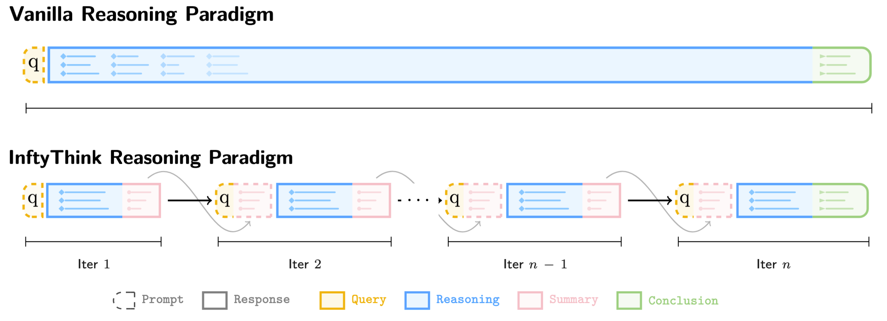

<div align="center">
     <h1>InftyThink+: Effective and Efficient Infinite-Horizon Reasoning via Reinforcement Learning</h2>
</div>

<div align='center'> 

[Yuchen Yan](mailto:yanyuchen@zju.edu.cn)<sup>1,2,\*</sup>, &nbsp;
Liang Jiang<sup>2</sup>, &nbsp;
Jin Jiang<sup>3</sup>, &nbsp;
Shuaicheng Li<sup>2</sup>, &nbsp;
<br>
Zujie Wen<sup>2</sup>, &nbsp;
Zhiqiang Zhang<sup>2</sup>, &nbsp;
Jun Zhou<sup>2</sup>, &nbsp;
[Jian Shao](mailto:jshao@zju.edu.cn)<sup>1</sup>, &nbsp;
Yueting Zhaung<sup>1</sup>, &nbsp;
[Yongliang Shen](mailto:syl@zju.edu.cn)<sup>1,†</sup>  

<sup>1</sup>Zhejiang University, &nbsp;
<sup>2</sup>Ant Group, &nbsp;
<sup>3</sup>Peking University  
<em>Preprint. Under review.</em>  
<sup>*</sup>Contribution during internship at Ling Team, Ant Group. <sup>†</sup>Corresponding Author
</div>

<!-- <p align="center">
🤗 <a href="https://huggingface.co/datasets/ZJU-REAL/InftyThink">Dataset</a> |
 <a href="https://arxiv.org/abs/2503.06692">Arxiv</a> 
| 📑 <a href="https://zju-real.github.io/InftyThink/">WebPage</a> 
<br>
</p> -->
<p align="center">
 <a href="https://arxiv.org/abs/2602.06960">Arxiv</a> 
| 📑 <a href="https://zju-real.github.io/InftyThink-Plus/">WebPage</a> 
<br>
</p>

## News 🔥🔥
- **2026.02.09:** We release our paper.

## Overview 🦾🦾


Building upon our previous work <a href='https://github.com/ZJU-REAL/InftyThink'>InftyThink</a>, we introduce InftyThink+, an end-to-end reinforcement learning framework that directly optimizes the complete iterative reasoning trajectory. Building on InftyThink’s paradigm of model-controlled iteration boundaries and explicit summarization, our approach proceeds in two stages: a cold-start stage that uses supervised fine-tuning to establish the basic iterative reasoning format, followed by an RL stage that optimizes strategic decisions through trajectory-level learning. We carefully design the rollout strategy, reward formulation, and policy gradient estimation tailored to InftyThink’s single-trajectory, multi-inference structure. This design separates format acquisition from strategy optimization, enabling the model to learn not only how to produce iterative reasoning, but also when to summarize, what to preserve, and how to effectively leverage self-generated summaries across iterations.

## QuickStart 🎯🎯

```
Codes and documentations are on the way.
```

## Citation

If you find our work helpful, feel free to give us a cite.

```
@misc{yan2026inftythinkplus,
      title={InftyThink+: Effective and Efficient Infinite-Horizon Reasoning via Reinforcement Learning}, 
      author={Yuchen Yan and Liang Jiang and Jin Jiang and Shuaicheng Li and Zujie Wen and Zhiqiang Zhang and Jun Zhou and Jian Shao and Yueting Zhuang and Yongliang Shen},
      year={2026},
      eprint={2602.06960},
      archivePrefix={arXiv},
      primaryClass={cs.CL},
      url={https://arxiv.org/abs/2602.06960}, 
}
```

## Contact Us
If you have any questions, please contact us by email: 
yanyuchen@zju.edu.cn
